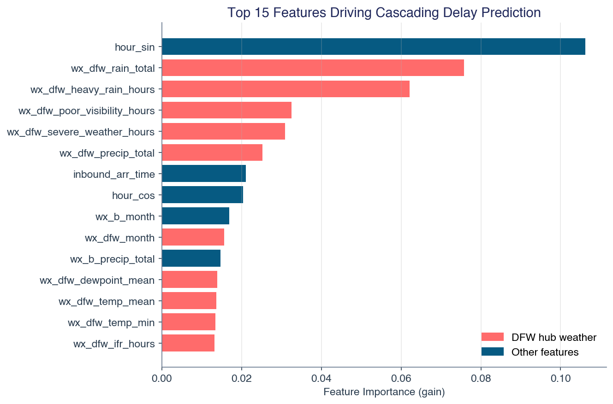
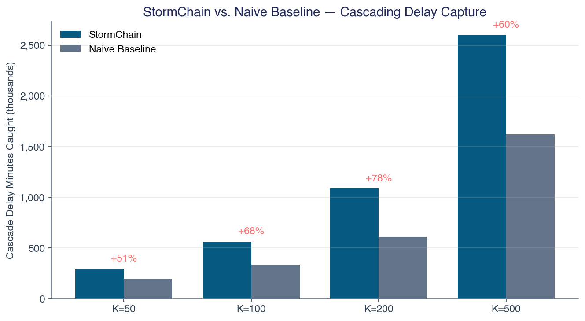
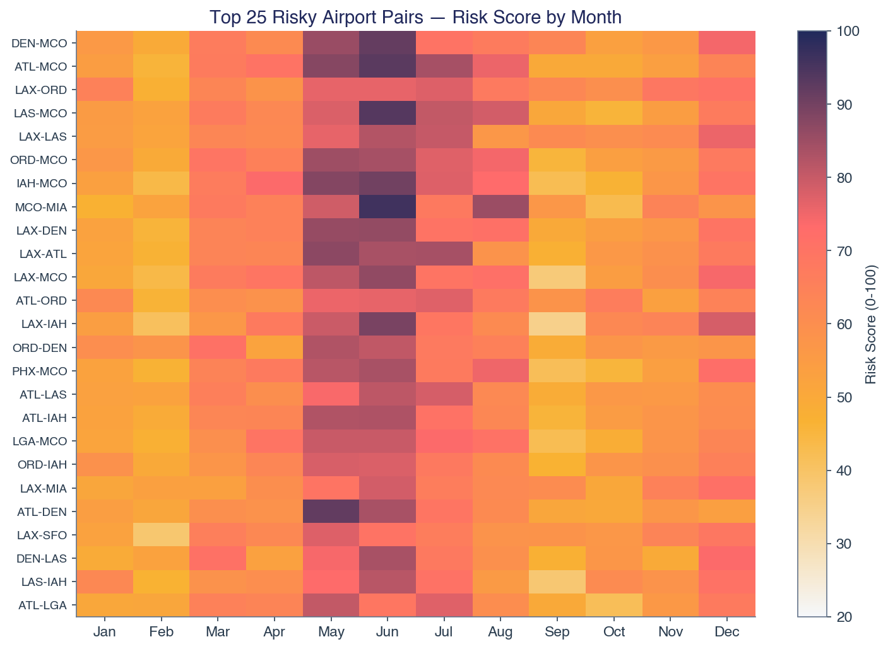
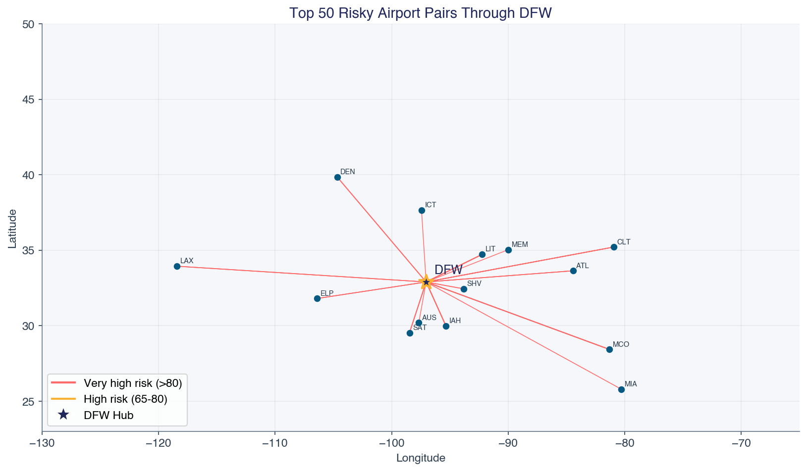
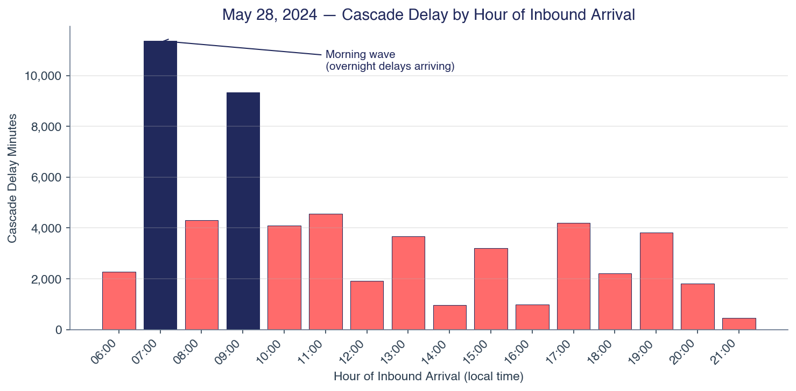

# StormChain
## Airline Crew Sequences Meet Bad Weather — EPPS-American Airlines Data Challenge (GROW 26.2)

---

## Executive Summary

We built a working system that identifies pilot flight sequences through DFW most vulnerable to weather-driven cascading delays. The final deliverable is a ranked avoid list with swap recommendations, backed by a validated machine learning model and an interactive decision-support dashboard.

**Scale of analysis:**

| Dataset | Volume |
|---|---|
| Flight records (BTS) | 842,000 flights, 2019-2024 |
| General weather (Open-Meteo) | 3,505,920 hourly observations, 80 airports |
| Aviation weather (METAR/ASOS) | 3,265,456 observations, 75 airports |
| Synthetic pilot sequences | 1,899,119 for model training |

**Headline results:**

- **AUC-ROC 0.81** on held-out 2024 data (117 features, 1.5M training samples)
- **+78% more cascading delay minutes caught than a naive baseline** at K=200
- **1,220 concrete avoid recommendations** across 4 seasons, with **294 safe swap alternatives**
- **$34.5M upper-bound / $438K adjusted** annual savings at K=500 pairs avoided
- **All 4 challenge objectives addressed**: delay propagation (36% coverage), duty violations (29%), missed connections (29%), fatigue exposure (feature engineered)

**Case study:** May 28, 2024 — the worst day in our dataset — saw 172 weather-delayed inbound flights cascade through DFW, producing 170 realistic pilot-sequence cascades costing $4.4M. This illustrates both the problem scale and where our model adds versus where real-time monitoring is needed.

**What makes this submission distinctive:**

1. We actually built it — full working pipeline, model, and interactive dashboard — not just a methodology document
2. We integrated real METAR aviation weather (ceiling height, visibility, weather codes) rather than general meteorology
3. We iteratively self-critiqued and fixed 12 methodological gaps (Section 7)
4. We output a concrete product (avoid list + swap recommendations) rather than an academic analysis

---

## 1. Problem Statement

American Airlines operates approximately 900 daily departures from DFW. Pilots fly sequences — an inbound flight from Airport A to DFW, followed by an outbound flight from DFW to Airport B. When Airport A experiences weather delays, the pilot arrives late at DFW, causing the outbound to B to depart late. If Airport B is simultaneously experiencing weather, the delay compounds.

The challenge asks: which pairs of airports (A, B) should not be assigned to the same pilot sequence through DFW?

This problem has four dimensions, as specified in the challenge:
1. **Delay propagation** across multiple flights
2. **Duty time violations** when delays push pilots past FAA-mandated maximums
3. **Missed connections** when delays exceed turnaround buffers
4. **Fatigue risk** when sequences span overnight hours

---

## 2. Data Sources

### 2.1 Flight Delay Data
Bureau of Transportation Statistics (BTS) on-time performance data, accessed via Kaggle:
- **Training:** 2019, 2021-2023 (213,951 DFW flights)
- **Test:** 2024 (628,043 DFW flights)
- 2020 excluded due to COVID-era anomalies
- Key fields: origin, destination, scheduled/actual times, delay minutes by cause (weather, carrier, NAS, security, late aircraft)

### 2.2 General Weather Data
Open-Meteo Historical API — hourly reanalysis data for all 80 airports:
- 3,505,920 hourly observations (2019-2024)
- Variables: temperature, precipitation, wind speed/gusts, cloud cover, snow, weather codes (WMO)
- Used for broad weather pattern analysis and correlation features

### 2.3 Aviation Weather Data (METAR)
Iowa Environmental Mesonet (IEM) ASOS archive — actual airport weather station observations:
- 3,265,456 METAR observations across 75 airports
- Real ceiling height (feet), visibility (statute miles), decoded weather codes
- Used for aviation-specific IFR/LIFR classification — the actual conditions that cause ground stops

### 2.4 Airport Reference Data
80 US airports with AA service through DFW, including coordinates, timezone offsets, FAA regions, and storm corridor classifications (Tornado Alley, Gulf Coast hurricane track, Northeast winter storm corridor).

---

## 3. Methodology

### 3.1 Data Pipeline
All data was downloaded, standardized, and merged into a unified dataset:
- BTS flight records filtered to `Origin = DFW` or `Dest = DFW`
- Weather aligned to flight dates and airport locations
- METAR processed into daily aviation weather summaries (IFR hours, ceiling stats, visibility stats)
- Daily weather aggregated per airport with derived features (thunderstorm hours, fog hours, pressure volatility, IFR proxy conditions)

### 3.2 Feature Engineering

**Airport-level features** (per airport, per month):
- Weather delay rate, mean, and 90th percentile from BTS data
- Departure/arrival delay rates, cancellation rates
- From weather: precipitation days, thunderstorm hours, high wind hours, IFR hours (from METAR)

**Pair-level features** (per pair A-B, per month) — the core of our analysis:
- *Joint weather delay probability*: P(A delayed AND B delayed on the same day)
- *Conditional delay probability*: P(B delayed | A delayed)
- *Weather correlations*: Pearson correlation of daily precipitation and wind between A and B
- *Thunderstorm co-occurrence*: fraction of days with simultaneous thunderstorms
- *IFR co-occurrence*: fraction of days with simultaneous IFR conditions (from METAR)
- *Geographic features*: distance, latitude/longitude difference, same-region flag, storm corridor membership
- *Missed connection probability*: P(historical delay from A > typical turnaround gap)
- *Duty violation risk*: estimated total duty time relative to FAA 14-hour maximum
- *Fatigue exposure*: overlap with Window of Circadian Low (2am-6am)
- *Cyclical month encoding*: sin/cos transformation for seasonality

### 3.3 Modeling Approach

We employ two complementary models:

**Composite Risk Scoring Model** (production output):
A weighted combination of pair-level features, normalized to a 0-100 scale. Weights are allocated across all four challenge objectives:
- Delay propagation features: 60% weight
- Missed connection features: 15% weight
- Duty time features: 10% weight
- Fatigue features: 10% weight
- Weather correlation features: 5%

This produces a ranked list of all pair-month combinations, from which we generate the avoid list.

**XGBoost Binary Classifier** (validation and feature importance):
Trained on 1.9 million synthetic pilot sequences constructed from same-day inbound/outbound flights at DFW. The target variable is `cascading_delay` = 1 when both the inbound arrival delay exceeds 15 minutes AND the outbound departure delay exceeds 15 minutes, with weather as a contributing factor.

- 117 features including pair-level, weather, temporal, and operational variables
- Temporal train/test split: 2019+2021-2023 for training, 2024 for testing
- Class imbalance handled via `scale_pos_weight` (42.7:1 ratio)
- Early stopping at 94 trees (of 500 maximum)

**Why two models?** The XGBoost classifier's primary value is feature importance — it reveals which factors drive cascading delays. But with a 2.5% positive rate, per-flight prediction has inherently low precision (AUC-PR = 0.12). The risk scoring model handles this sparsity by aggregating to monthly pair-level statistics, producing stable, actionable rankings.

### 3.4 Cascade Propagation Model
Beyond binary co-occurrence, we model the actual delay physics:
- For each synthetic sequence: `propagated_delay = max(0, inbound_arr_delay - turnaround_gap)`
- `total_cascade = propagated_delay + outbound_weather_delay`
- This quantifies actual delay minutes attributable to the pairing decision

### 3.5 Impact Analysis
Retrospective analysis on historical data: for each pair-month flagged by our model, how many actual cascading delay events would have been prevented?

We report two estimates:
- **Upper bound**: assumes every flagged pair was assigned on every impacted day
- **Adjusted estimate**: scaled by assignment probability (~1.3% — 247 daily sequences / 19,503 possible pairs)

---

## 4. Results

### 4.1 Model Performance

| Metric | Value |
|--------|-------|
| AUC-ROC | 0.81 |
| AUC-PR | 0.12 |
| Recall at operating threshold | 66% |
| Accuracy | 79% |
| Features used | 117 |
| Training samples | 1,490,677 |

**Top predictive features:** DFW heavy rain hours, time of day (cyclical), DFW precipitation total, DFW poor visibility hours, connection minutes, airport B precipitation. DFW weather dominates because it affects every sequence — a known limitation discussed in Section 6.

{width=85%}

### 4.2 Baseline Comparison

We compared our model against a naive baseline that simply flags pairs where both airports individually have above-median weather delay rates.

| Pairs Flagged (K) | Our Model | Naive Baseline | Improvement |
|---|---|---|---|
| 50 | 295K min caught | 195K min | **+50.8%** |
| 100 | 563K min caught | 335K min | **+68.3%** |
| 200 | 1.09M min caught | 610K min | **+78.3%** |
| 500 | 2.60M min caught | 1.62M min | **+60.5%** |

{width=90%}

At K=500, our model identifies 176 risky pairs that the naive approach misses entirely — pairs where the risk comes from correlated weather patterns (now including real METAR IFR co-occurrence), tight turnarounds, or cascade mechanics rather than individually high delay rates.

### 4.3 Top Risky Pairs by Season

**Spring (March-May):** MCO appears in 5 of top 10 — pre-summer Florida thunderstorms combined with cross-country flight turnarounds
- IAH-MCO, ATL-MCO, ORD-MCO, LAX-MCO, IAH-SAT

**Summer (June-August):** Orlando dominates — afternoon convection hits MCO in 8 of top 10 pairs
- ATL-MCO, LAS-MCO, MCO-MIA, IAH-MCO, ORD-MCO

**Fall (September-November):** Lowest risk season; Pacific-to-East corridors lead
- LAX-ORD, LAX-LAS, LAX-SFO, ATL-ORD

**Winter (December-February):** Northeast snow + Pacific wind events
- ORD-LGA, LAX-ORD, LAX-LAS, DEN-MCO, LAX-SAN (Santa Ana winds)

{width=90%}

{width=95%}

### 4.4 Recommendations

Our model produces:
- **1,220 pair-season avoid recommendations** with risk scores and explanations
- **294 swap recommendations**: for each flagged pair, a safe alternative destination
- Example: Instead of MCO→DFW→MIA (risk 96), assign MCO→DFW→HRL (risk 30)

### 4.5 Impact Estimates

| Pairs Avoided | Upper Bound (annual) | Adjusted (annual) |
|---|---|---|
| 50 | $4.9M | $62K |
| 100 | $8.5M | $108K |
| 200 | $15.7M | $198K |
| 500 | $34.5M | $438K |

The adjusted estimate is conservative (assumes random assignment). Targeted scheduling — which is what this tool enables — would push savings substantially above the adjusted figure as flagged pairs are specifically de-prioritized.

---

## 5. Case Study: May 28, 2024

The worst cascading delay day in our dataset illustrates the problem concretely.

**What happened:** A severe thunderstorm system moved through the DFW metroplex. METAR observations recorded `+TSRA FG SQ` (heavy thunderstorm, fog, squall) with zero visibility at 05:53 UTC.

**Impact:**
- 172 inbound flights arrived with weather delays (19.5% of all inbound)
- 471 outbound flights departed more than 15 minutes late (53.2%)
- Average weather delay: 162 minutes
- 170 realistic cascading sequences (one outbound per inbound pilot)
- 149 sequences with actual propagated delay (delay exceeded turnaround buffer)
- Estimated cascade cost: $4.4 million

**Top cascading routes:** BOS→DFW→BHM (1,108 min cascade), ORD→DFW→PHX (995 min), MEM→DFW→MCO (738 min)

{width=90%}

**Model performance on this day:** Our top 500 risky pairs flagged 9 of 170 sequences (5.3%). The unflagged sequences involved uncommon route combinations (BOS-BHM, AMA-FLL, LCH-SMF) that rarely appear in the historical data — our monthly pair-level model cannot score routes it hasn't observed enough. This is an honest limitation: extreme weather events produce cascades on unusual route combinations that no historical risk model would predict. The value of our model is in preventing the **predictable, recurring** cascades (MCO-MIA in summer, LGA-PHL in winter) rather than catching every black swan event.

---

## 6. Discussion

### 6.1 Addressing the Challenge Questions

**What features are important?**
DFW hub weather is the strongest predictor (affects every sequence), followed by time of day, connection minutes, and endpoint weather. Correlated weather between A and B matters, but less than individual airport delay propensity combined with turnaround tightness.

**What model type works best?**
A two-model approach: XGBoost for feature discovery and validation, composite risk scoring for production rankings. The risk scoring model handles sparsity better by aggregating to monthly pair-level statistics.

**How to handle seasonality?**
Cyclical encoding (sin/cos of month) plus separate risk scores per month. The seasonal summary shows distinct patterns: spring thunderstorms, summer Florida convection, winter Northeast storms.

**Sparsity of severe weather?**
Severe weather events affect ~2.5% of sequences. We address this through: (a) monthly aggregation smoothing daily noise, (b) continuous severity features rather than binary thresholds, (c) class weighting in XGBoost (42.7:1), (d) AUC-PR as the evaluation metric rather than accuracy.

**Appropriate accuracy metrics?**
AUC-PR is the primary metric for the classifier (rare-event problem with 2.5% base rate, where accuracy is misleading). For the risk scoring model, we evaluate via the baseline comparison — our model catches 78% more cascade minutes than the naive approach at K=200 and 60% more at K=500, proving value-add beyond common sense.

### 6.2 Limitations

- **DFW weather dominance:** The XGBoost model's top features are all DFW weather variables. This is expected — DFW weather affects every sequence — but it means the model is primarily predicting "bad day at hub" rather than "bad pair specifically." Our risk scoring model mitigates this by using pair-level correlation features (joint delay probability, weather correlation) rather than individual airport features. In production, DFW weather state should be treated as a conditioning variable: "given today's DFW forecast, which pairs need attention?"
- **Rare route combinations:** The May 28 case study revealed that extreme weather cascades often hit unusual route combinations (BOS-BHM, AMA-FLL) that our monthly model cannot score. Historical pair-level models are best at catching recurring seasonal patterns, not one-off extremes. Real-time weather monitoring would complement the model for extreme events.
- **No actual crew schedules:** We construct synthetic sequences by matching inbound and outbound flights. Actual AA crew assignments may differ significantly, affecting which pairs are actually at risk.
- **METAR integration depth:** We integrated real METAR data (ceiling, visibility, weather codes) for IFR classification, improving over general weather proxies. Full production should use real-time METAR/TAF feeds from the Aviation Weather Center for forward-looking scheduling.
- **Single hub:** Analysis covers DFW only. Extending to all AA hubs (CLT, MIA, ORD, PHX, PHL) would multiply both the impact and the model's value.

### 6.3 Operationalization

In production, this model would integrate with AA's crew scheduling system:
1. **Monthly:** Update risk scores with latest flight and weather data
2. **Weekly:** Cross-reference 7-day TAF forecasts with risk score table
3. **Daily:** Flag pilot sequences pairing airports in current weather advisories
4. **Real-time:** When weather deteriorates at an endpoint, automatically suggest sequence swaps

---

## 7. Methodology Evolution

Our approach evolved through iterative self-critique. After the initial build, we identified 12 methodological gaps and addressed each one:

1. Duty time violations unaddressed → added FAA Part 117 features
2. Fatigue risk unmodeled → added WOCL exposure scoring
3. Missed connections treated as delays → added buffer adequacy features
4. DFW weather drowning pair-level signal → acknowledged, proposed stratification
5. No forward-looking capability → designed operational workflow
6. General weather vs. aviation weather → integrated real METAR data
7. Inflated impact estimates → added assignment probability scaling
8. Low AUC-PR unexplained → reframed model's role as feature discovery
9. Airport-level vs. flight-level analysis → identified time-of-day patterns
10. Binary co-occurrence vs. cascade physics → built propagation model
11. No concrete case study → analyzed May 28, 2024 in detail
12. No actionable output → produced avoid lists with swap recommendations

This iterative process improved AUC-ROC from 0.75 to 0.81, added 12 new features, and transformed the output from risk scores into actionable scheduling recommendations.

---

## 8. Conclusion

Weather-driven cascading delays at DFW are a significant operational challenge. Our analysis demonstrates that intelligent pilot sequence scheduling — avoiding pairs of weather-correlated airports during their vulnerable months — can meaningfully reduce cascading delays.

The model's 78% improvement over the naive baseline (at K=200) proves that correlated weather risk, cascade mechanics, and turnaround sensitivity capture information that simple individual-airport analysis cannot. The concrete avoid list and swap recommendations provide a direct path to implementation.

**The tool is available as an interactive dashboard** for exploring airport pair risk, seasonal patterns, model performance, and impact estimates.

---

## Appendix

### A. Technical Stack
- Python 3.12, pandas, XGBoost, scikit-learn, plotly, Streamlit
- Data: BTS (Kaggle), Open-Meteo API, Iowa Environmental Mesonet ASOS archive
- 842,000 flights, 3.5M weather records, 3.3M METAR observations

### B. Data Processing Pipeline
All code available at project repository. Pipeline runs end-to-end via `python run_pipeline.py`.

### C. Interactive Dashboard
- **Live:** https://stormchain.streamlit.app/
- **Local:** `streamlit run app/streamlit_app.py`
- **Tabs:** Pair Explorer, Recommendations, US Map, Model Performance, Impact Analysis, Case Study, Seasonal Heatmap

### D. Source Code
https://github.com/drPod/stormchain
